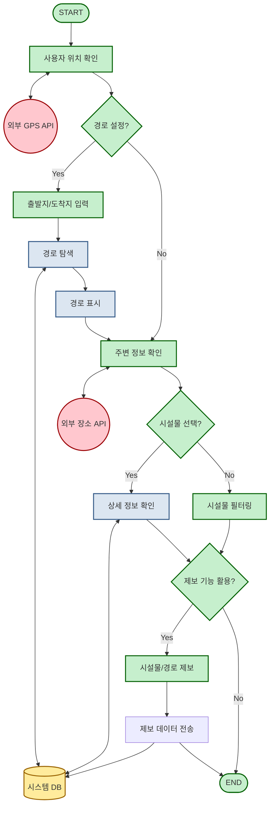

# 📍 Barrier-Free 지도 서비스 DB 설계

본 문서는 교통약자의 이동권 보장을 위한 내비게이션 시스템의 **논리 데이터 모델(RDB)** 과 이를 **그래프 데이터베이스(Neo4j)** 로 매핑하는 과정을 다룹니다.
즉, **"데이터 관리는 MySQL에서 안전하게, 길 찾기는 Neo4j에서 빠르게"**
---

## 📌 1. 논리 데이터 모델 (RDB)

RDB 설계의 핵심은 데이터의 **무결성**과 **방향성(Directed Graph)** 을 보장하는 것입니다. 특히 휠체어 내비게이션의 특성상 오르막과 내리막의 난이도가 다르므로, 출발지와 도착지를 한 쌍(튜플)으로 묶어 관리하는 **복합 키(Composite Key)** 구조를 채택했습니다.

> ### 1) POI (지점 정보) 엔티티

모든 거점(꺾이는 곳, 입구, 시설 등)을 정의합니다.

| 속성명 (Attribute) | 논리적 의미 | 비고 |
| :--- | :--- | :--- |
| **POI_ID** | 지점 고유 식별자 | **PK** (UUID 또는 의미적 코드) |
| **POI_NAME** | 지점 명칭 | 예: 정보문화관 정문, 본관 1번 코너 |
| **POI_TYPE** | 지점 유형 | 입구, 경사로, 엘리베이터, 화장실 등 |
| **LATITUDE** | 위도 | GPS 좌표 정보 |
| **LONGITUDE** | 경도 | GPS 좌표 정보 |
| **FLOOR_INFO** | 층수 정보 | 예: 1F, B1, 야외 등 |
| **DESCRIPTION** | 상세 설명 |찾아가는 법 등 |
| **PHOTO_URL** | 사진 경로 | 실제 환경 확인용 이미지 주소 |
| **IS_INTERIOR** | 실내 여부 | 실내 시설물인지 실외 지점인지 구분 |

---

> ### 2) PATH_CONNECTION (경로 연결) 엔티티

**튜플(Tuple) 기반 왕복 처리**를 구현하는 유향 그래프를의 엣지 데이터입니다.

| 속성명 (Attribute) | 논리적 의미 | 비고 |
| :--- | :--- | :--- |
| **START_POI_ID** | 출발지 식별자 | **PK/FK** (POI_ID 참조) |
| **END_POI_ID** | 도착지 식별자 | **PK/FK** (POI_ID 참조) |
| **DISTANCE** | 경로 거리 | 미터(m) 단위 실측 거리 |
| **SLOPE_DEGREE** | 경사도 | 방향에 따른 수치 (오르막은 +, 내리막은 -) |
| **EFFORT_LEVEL** | 노력 등급 | 1~5단계 (경사/폭 기반 자동 산정) |
| **PATH_WIDTH** | 유효 폭 | 휠체어 통과 가능 너비(m) |
| **IS_ACTIVE** | 통행 가능 상태 | 장애물 제보 등에 따른 실시간 상태 |

---

> ### 3) FACILITY_DETAIL (편의시설 상세) 엔티티

배리어프리 매장, 지하철 위치 등 고정된 시설의 상세 정보를 담습니다.

| 속성명 (Attribute) | 논리적 의미 | 비고 |
| :--- | :--- | :--- |
| **FACILITY_ID** | 시설 고유 식별자 | **PK**  |
| **POI_ID** | 연결된 지점 식별자 | **FK** (해당 시설이 위치한 POI) |
| **CATEGORY** | 시설 카테고리 | 배리어프리 매장, 지하철역, 휴게실 등 |
| **OPEN_HOURS** | 영업 시간 | 시설 이용 가능 시간 |
| **TEL_NO** | 연락처 | 문의 및 예약용 전화번호 |
| **FACILITY_FEATURESH** | 시설 특징 | 경사로 유무, 넓은 입구 등 상세 텍스트 |


---

> ### 4) USER_REPORT (사용자 제보) 엔티티

사용자가 발견한 실시간 장애물 데이터를 관리하여 경로 계산에 반영합니다.

| 속성명 (Attribute) | 논리적 의미 | 비고 |
| :--- | :--- | :--- |
| **REPORT_ID** | 제보 고유 식별자 | **PK** |
| **USER_ID** | 제보자 식별자 | **FK** (사용자 테이블 참조) |
| **LAT** | 제보 위치 (위도) | 장애물 발생 지점 좌표 |
| **LNG** | 제보 위치 (경도) | 장애물 발생 지점 좌표 |
| **CATEGORY** | 장애물 유형 | 불법주차, 단차, 공사, 고장(엘베) 등 |
| **PHOTO_URL** | 장애물 사진 | 제보자가 촬영한 현장 사진 URL |
| **STATUS** | 처리 상태 | 대기, 승인, 해결 등 |
| **CREATED_AT** | 제보 시간 | 데이터 신뢰도 판단 기준 |

---

> ### 5) EMERGENCY_MATCH (긴급 매칭) 엔티티

긴급 상황 발생 시 사용자와 봉사자를 매칭하는 기능입니다.

| 속성명 (Attribute) | 논리적 의미 | 비고 |
| :--- | :--- | :--- |
| **REQUEST_ID** | 요청 고유 식별자 | **PK** |
| **REQUESTER_ID** | 요청자 | **FK** |
| **VOLUNTEER_ID** | 매칭된 봉사자 | **FK** (매칭 전까진  NULL) |
| **MESSAGE** | 긴급 메시지 | 상황 설명(예: "휠체어 바퀴가 배수구에 끼었습니다") |
| **LAT/LNG** | 요청 위치 | 도움이 필요한 현재 GPS 좌표 |
| **MATCH_STATUS** | 매칭 상태 | 요청중, 수락, 완료, 취소 |

---

## 📌 2. 그래프 데이터 모델링(Neo4j Mapping) 

RDB의 정적인 테이블 구조를 Neo4j의 **유연한 노드(Node)와 관계(Relationship)** 로 변환하여 경로 탐색 알고리즘의 효율성을 극대화합니다.

> ### 🔄 매핑 전략

1. Node 변환: POI테이블의 모든 행은 `(:POI)` 노드가 됩니다. 테이블의 모든 컬럼(`FLOOR_INFO`, `PHOTO_URL` 등)은 노드의 Properties로 저장이 됩니다.

2. Relationship 변환: `PATH_CONNECTION` 테이블은 `-[:LEADS_TO]->` 관계(Relationship)가 됩니다. 출발/도착 ID를 기준으로 화살표가 연결되며, 그 내부에 `SLOPE_DEGREE`와 `EFFORT_LEVEL` 속성이 담깁니다.

3. 시설물 연결: `FACILITY_DETAIL` 정보는 별도의 노드 혹은 POI의 속성으로 매핑되어 `-[:LOCATED_AT]->` 관계로 연결됩니다.





---

## 📌 3. 핵심 설계 포인트

- **방향성 보존**: 단순히 점들을 잇는 것이 아니라, 튜플 구조를 통해 **방향에 따른 가중치(오르막/내리막)** 를 명확히 분리했습니다.

- **현장성 강화**: 건물 내부의 복잡한 노드 생성 대신, **사진과 상세 설명** 을 속성에 포함하여 사용자가 현장에서 즉시 상황을 파악하도록 설계했습니다.

- **유연한 확장**: RDB의 안정성과 그래프 DB의 강력한 경로 연산(Dijkstra, A*)을 결합할 수 있는 하이브리드 지향 모델입니다.

---

## 📌 4. 사용자가 POI 위에 있지 않을 때

> ### 1) 근본적 해결책: "가장 가까운 곳 찾기"

사용자가 POI가 아닌 곳에 있을 때, 시스템은 두 가지 방식으로 대응합니다.

1. 가장 가까운 POI 매칭: 사용자의 현재 위도/경도에서 직선 거리가 가장 짧은 POI를 출발지로 설정합니다.

2. 경로 위에 투영(Snapping): 사용자가 두 POI 사이의 길 위에 있다면, '길(Edge)'에서 가장 가까운 가상의 점을 찍어 경로를 계산합니다.

이를 위해 DB 설계에서 **위치 정보의 유연성**을 확보해야 합니다.

---

> ### 2) 시스템 로직 처리 방법

1. 사용자 위치 수집: 앱에서 현재 GPS(Lat, Lng)를 받습니다.

2. 가까운 POI 검색 (Nearest Neighbor): 

```SQL 
SELECT poi_id FROM poi ORDER BY (사용자 위치와의 거리) ASC LIMIT 1;
```

- 이 쿼리를 통해 가장 가까운 POI를 찾아 '가상 출발지'로 삼습니다.

3. 경로 안내: 찾은 POI부터 목적지 POI까지의 경로를 Neo4j에서 계산하여 안내합니다.

---

## 📌 5. 데이터 정합성 문제 해결

- 백엔드(Java/Python)에서 DB를 저장할 때, `saveToMySQL()` 직후에 `updateNeo4j()`를 실행하는 함수를 하나로 묶어 MySQL과 Neo4j를 동기화합니다.