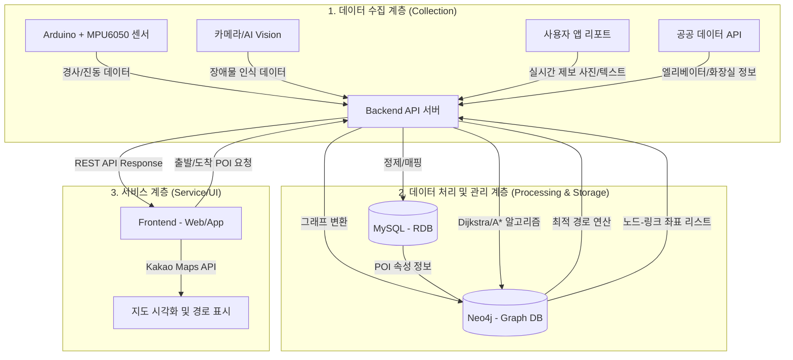

# 📍 Barrier-Free 지도 서비스 Servies System 설계

본 시스템은 교통약자(휠체어, 유모차 사용자 등)를 위해 경사도, 노면 상태, 장애물 정보를 반영한 __실시간 고정밀 내비게이션__ 을 제공하는 것을 목표로 합니다.

---

## 📌 1. 시스템 아키텍처 다이어그램

---

## 📌 2. 모듈별 상세 설명 및 데이터 입출력
| 모듈명 | 주요 기능 및 역할 | Input | Output |
| :--- | :--- | :--- | :--- |
| **데이터 수집** | 하드웨어 센서 및 외부 API를 통한 원천 데이터 확보 | 경사도, 장애물 이미지, 공공 시설물 좌표 | 가공 전 원천 데이터(Raw Data) |
| **데이터 처리** | 원시 데이터 정제 및 AI 기반 분석(YOLOv8 등) 수행 | 실시간 ㅣ노면 정보, 제보 사진 | 노력 등급(Effort Level), 정제된 POI 속성 |
| **하이브리드 DB** | 데이터 무결성 관리(MySQL) 및 경로 탐색 최적화(Neo4j) | POI 정보, 경로 연결(Edge) 가중치 정보 | 경로 위상 구조(Topology), 상세 시설 정보 |
| **경로 탐색 엔진** | 가중치 기반 최적 경로(Dijkstra/A*) 산출 | 출발/도착지 POI ID, 사용자 유형 필터 | 최적 경로 좌표 리스트 (JSON) |
| **시각화** | Kakao Maps API를 통한 지도 및 경로 렌더링 | 경로 좌표, POI 마커 정보, 사진 URL | 사용자 화면 내 지도 및 경로 정보 |

--- 
