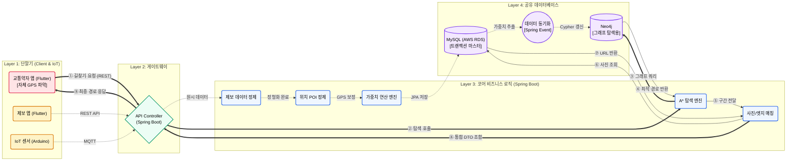

# 📍 Barrier-Free 지도 서비스 Servies System 설계

본 시스템은 교통약자(휠체어, 유모차 사용자 등)를 위해 경사도, 노면 상태, 장애물 정보를 반영한 __실시간 고정밀 내비게이션__ 을 제공하는 것을 목표로 합니다.

---

## 📌 1. 시스템 아키텍처 다이어그램

```mermaid
 flowchart LR
    classDef user fill:#ffe4e6,stroke:#e11d48,stroke-width:2px,color:#000
    classDef source fill:#fef3c7,stroke:#d97706,stroke-width:2px,color:#000
    classDef api fill:#ecfdf5,stroke:#059669,stroke-width:2px,color:#000
    classDef core fill:#eff6ff,stroke:#2563eb,stroke-width:2px,color:#000
    classDef db fill:#f3e8ff,stroke:#7c3aed,stroke-width:2px,color:#000

    subgraph Layer1["Layer 1: 단말기 (Client & IoT)"]
        direction TB
        AppUser(" 교통약자 앱 (Flutter)<br/>[자체 GPS 파악]"):::user
        AppReport(" 제보 앱 (Flutter)"):::source
        Sensor(" IoT 센서 (Arduino)"):::source
    end

    subgraph Layer2["Layer 2: 게이트웨이"]
        APIGW{"API Controller<br/>(Spring Boot)"}:::api
    end

    subgraph Layer3["Layer 3: 코어 비즈니스 로직 (Spring Boot)"]
        direction TB
        DataClean(" 제보 데이터 정제"):::core
        LocResolver(" 위치 POI 정제"):::core
        WeightCalc(" 가중치 연산 엔진"):::core
        PathEngine(" A* 탐색 엔진"):::core
        PhotoMatch(" 사진/엣지 매칭"):::core
    end

    subgraph Layer4["Layer 4: 공유 데이터베이스"]
        direction TB
        MySQL[(" MySQL (AWS RDS)<br/>[트랜잭션 마스터]")]:::db
        Sync((" 데이터 동기화<br/>[Spring Event]")):::db
        Neo4j[(" Neo4j<br/>[그래프 탐색용]")]:::db
    end

    %% 수집 흐름 (점선)
    AppReport -. "REST API" .-> APIGW
    Sensor -. "MQTT" .-> APIGW
    APIGW -. "원시 데이터" .-> DataClean
    DataClean -. "정형화 완료" .-> LocResolver
    LocResolver -. "GPS 보정" .-> WeightCalc
    WeightCalc -. "JPA 저장" .-> MySQL
    MySQL -. "가중치 추출" .-> Sync
    Sync -. "Cypher 갱신" .-> Neo4j

    %% 서비스 흐름 (실선)
    AppUser == "① 길찾기 요청 (REST)" ==> APIGW
    APIGW == "② 탐색 호출" ==> PathEngine
    PathEngine == "③ 그래프 쿼리" ==> Neo4j
    Neo4j -- "④ 최적 경로 반환" --> PathEngine
    PathEngine -- "⑤ 구간 전달" --> PhotoMatch
    PhotoMatch -- "⑥ 사진 조회" --> MySQL
    MySQL -- "⑦ URL 반환" --> PhotoMatch
    PhotoMatch == "⑧ 통합 DTO 조합" ==> APIGW
    APIGW == "⑨ 최종 경로 응답" ==> AppUser


```

---

## 📌 2. 시스템 모듈별 상세 설명 및 데이터 입출력(I/O) 명세

교통약자 맞춤형 배리어 프리 맵 서비스의 각 모듈별 핵심 역할과 데이터의 입력(Input) 및 출력(Output) 흐름은 다음과 같습니다. 데이터의 수집 경로와 서비스 제공 경로를 명확히 분리하여 아키텍처의 직관성을 높였습니다.

| 레이어 (Layer) | 모듈명 | 핵심 역할 (Description) | 입력 데이터 (Input) | 출력 데이터 (Output) |
| :--- | :--- | :--- | :--- | :--- |
| **Layer 1. 사용자/소스** | **교통약자 앱** | 길찾기 요청 및 경로 안내 UI 제공 | 출발지/도착지 좌표, 사용자 유형(휠체어 등) | 최적 경로 노드 리스트, 매칭된 장애물/노면 사진 |
| | **시민 제보 앱** | 도로 상태 및 장애물 크라우드소싱 | 사진, 위치 좌표(GPS), 텍스트 설명 | 제보 성공 응답 (200 OK) |
| | **IoT 센서** | 아두이노 기반 노면 진동/경사도 수집 | 하드웨어 센서 측정값 | 원시 센서 데이터 스트림 (JSON/MQTT) |
| **Layer 2. 게이트웨이** | **API Controller** | 들어오는 모든 요청을 적절한 모듈로 라우팅 | REST/MQTT 기반의 모든 Client 요청 | 분배된 내부 호출 (내부 시스템 규격) |
| | **위치 정제 모듈** | 오차가 있는 GPS 좌표를 가장 가까운 노드(POI)로 보정 | 원시 GPS 좌표 (위도/경도) | 정제된 POI 노드 ID |
| **Layer 3. 핵심 로직** | **가중치 연산 엔진** | 센서/제보 데이터를 분석하여 특정 도로 구간의 위험도 산출 | 진동/경사도 수치, 제보 데이터 | 도로 엣지(Edge)별 업데이트용 가중치 값 |
| | **A * 탐색 엔진** | 교통약자 제약조건과 가중치가 반영된 최단/최적 경로 계산 | 출발지/도착지 노드 ID, 휠체어 등급 | 가중치 기반 최적 경로 (순차적 엣지 리스트) |
| | **사진/엣지 매칭** | 탐색된 경로 위에 존재하는 현장 사진을 결합 | 계산 완료된 경로 엣지 리스트 | 경로 + 사진 URL이 매핑된 최종 렌더링 데이터 |
| **Layer 4. 공유 DB** | **MySQL (Master)** | 회원 정보, 제보 원본 로그, 시스템 트랜잭션 등 정형 데이터 저장 | 회원가입 정보, 제보 원본 데이터 | 조회된 정형 데이터 및 사진 URL |
| | **데이터 동기화(Sync)** | MySQL에 적재된 위험도 데이터를 Neo4j 그래프에 실시간 반영 | MySQL의 업데이트 이벤트 | Neo4j 쿼리 (Cypher) |
| | **Neo4j (Graph)** | 공간 네트워크(노드/엣지) 및 동적 가중치 저장, 경로 탐색 제공 | 엣지 가중치 업데이트 요청, 탐색 쿼리 | A\* 알고리즘 연산 결과 (최적 경로 맵) |

--- 

## 📌 3. 시스템 모듈별 구현 기술 요약 (Tech Stack)

본 프로젝트의 안정적인 운영과 실시간 경로 연산 효율성을 극대화하기 위해 채택한 기술 스택 명세입니다.

#### ① Frontend & Client
* **Flutter (Dart)** / **Web HTML5**
  * **적용 대상:** 교통약자용 메인 앱, 시민 참여형 제보 앱 및 웹 인터페이스
  * **도입 목적:** iOS와 Android 환경에서 단일 코드베이스로 빠른 크로스 플랫폼 UI를 구현하고, 지도 SDK와의 유연한 연동을 달성하기 위함

#### ② Backend & Core Logic
* **Spring Boot (Java)** / **FastAPI (Python)**
  * **적용 대상:** API 게이트웨이(Controller), 가중치 연산 엔진, A\* 경로 탐색기
  * **도입 목적:** 대규모 요청 분산 처리 및 트랜잭션 안정성을 위해 메인 백엔드는 Spring Boot를 활용하고, 가볍고 빠른 이미지/데이터 전처리 모듈에는 FastAPI를 교차 배치하여 효율성 증대

#### ③ IoT & Edge Data Ingestion
* **Arduino (C++)** / **MQTT Protocol**
  * **적용 대상:** 휠체어 부착 하드웨어 센서 킷 및 데이터 스트리밍 파이프라인
  * **도입 목적:** 자이로 및 가속도 센서 제어와 실시간 노면 진동 데이터를 무선 네트워크 환경에서 초경량·저전력(MQTT)으로 유실 없이 전송하기 위함

#### ④ Database & Storage (Hybrid Topology)
* **MySQL 8.0**
  * **적용 대상:** 마스터 관계형 데이터베이스
  * **도입 목적:** 유저 계정, 권한 관리, 제보 원본 로그 등 무결성과 정형 트랜잭션(ACID) 보장이 필수적인 데이터 관리
* **Neo4j (Graph Database)**
  * **적용 대상:** 공간 인프라 네트워크 데이터베이스
  * **도입 목적:** 교차로(Node)와 인도 구간(Edge) 사이의 복잡한 연결 관계 속에서, 실시간 변동 가중치를 반영한 고속 최적 경로 탐색(Pathfinding) 연산 성능을 확보하기 위함

#### ⑤ Infra & Cloud Environment
* **AWS (Amazon Web Services)**
  * **적용 대상:** EC2, RDS 및 전체 시스템 서버 운영 환경
  * **도입 목적:** 클라우드 기반 아키텍처 설계를 통해 가용성을 높이고 인프라 관리를 체계화하기 위함